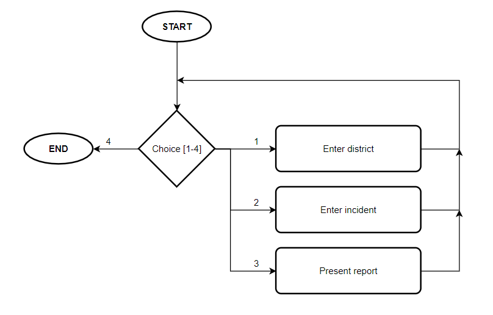
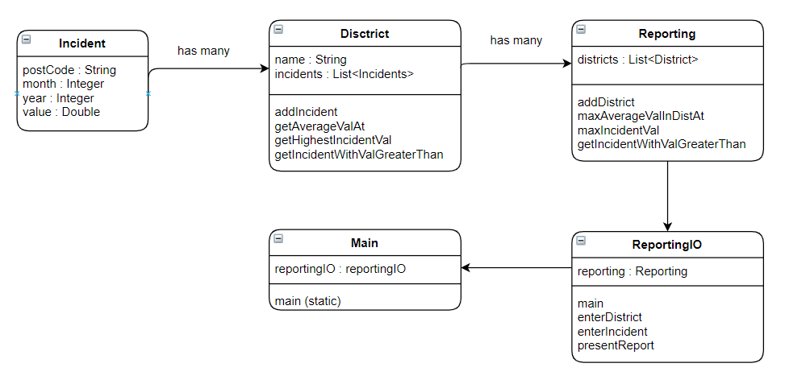

# Overview
This program enables the user to record incidents(burglaries) in certain areas of a country/region.
This way, they can keep track of the incidents details and generate reports based on them.

## Usage
### Running the program
Running the program itself is quite basic.
1. Clone the project with :
   - `git clone https://nucode.ncl.ac.uk/scomp/student-portfolios/c0026034-portfolio/csc1035/csc1035-proj-1.git`
   - Create project from version control in your IDE
   
2. Run [Main.java](/src/main/Main.java) whilst making sure that `CrimeReport/` is the root directory

### Using the program
- When the program is running the user should be welcomed with 4 options
    - Enter district
      - The program creates a new district based on the name given by the user
    - Enter incident
      - The program creates a new incident which can then be linked to a district
      based on the input given by the user
    - Present report
      - The program will generate a report
    - Exit
      - This will exit the program

### Program Loop

The program has 5 main states: a main menu, enter district, enter incident, present report
and the end of the program. The flowchart above reflects this behaviour. The graph doesn't
show the internal progression of sub-states 1 to 3.

#### State 1 Enter District
The user enters the **name** of the district, and the program creates a District Object based on
it, adding this new object to a list of Districts that are contained by the Reporting object.

#### State 2 Enter Incident
The user enters the **postcode** -> **month** -> **year** -> **value**, and then they also
get to choose which district they want to add the incident into. The user has an option to
create a new district if there currently isn't any, they also have a choice to add the incident
they created to a new district if they wanted to.

#### State 3 Present Report
The user enters the **year** that they want to generate the average from, and the **value**
that they intend to compare the values of the incidents to in order to generate a list that
exceeds that value.

## Architecture
This section discusses how the different classes are linked, how they interact with each other
and how the whole project itself integrates all of them to form one entity.

The diagram above shows how the classes interact with each other, their main components, and behaviour.
Assume that all classes have their own appropriate getters and setters. An arrow without annotations
means that the class being pointed to **has** a class as its field from where the arrow came from. 

District contains **many** Incident objects, Reporting contains **many** District objects, and ReportingIO 
contains **a** Reporting object. The Main class is separated from the actual objects that represent
an abstract form of data from real life to isolate the execution of the program from the structure of 
the classes, and the program loop that I have defined in ReportingIO.
